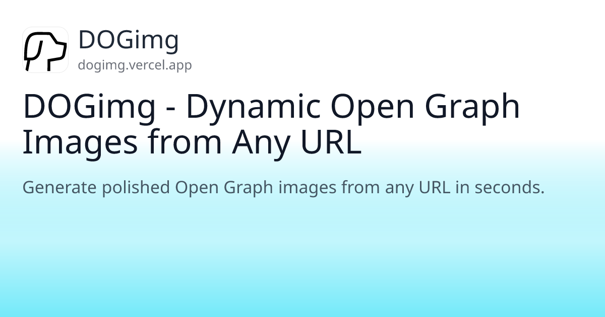

# DOGimg

Dynamic Open Graph Images from Any URL.

DOGimg generates polished Open Graph images from webpage metadata (title, description, favicon, theme color) using a single API call.

## Try It

- Demo: https://dogimg.vercel.app
- API: `https://dogimg.vercel.app/api/og?url={YOUR_URL}`

## Example Outputs

The images below were generated by real `/api/og` calls from this project.

| URL | Output |
| :-- | :----- |
| `https://dogimg.vercel.app` |  |
| `https://github.com` |  |
| `https://nextjs.org` |  |
| `https://vercel.com` |  |

## Usage

### HTML Meta Tag

```html
<meta property="og:image" content="https://dogimg.vercel.app/api/og?url=https://your-site.com/post" />
<meta property="og:image:width" content="1200" />
<meta property="og:image:height" content="630" />
```

### Next.js Metadata (App Router)

```ts
export async function generateMetadata() {
  const fullUrl = "https://your-site.com/your-page";

  return {
    openGraph: {
      images: [`https://dogimg.vercel.app/api/og?url=${fullUrl}`],
    },
  };
}
```

If your page URL contains query params, use `encodeURIComponent(fullUrl)`.

## API

### Endpoint

`GET /api/og?url={TARGET_URL}`

### URL Format

`https://dogimg.vercel.app/api/og?url={YOUR_URL}`

### Query Params

- `url` (string): Target webpage URL.
- If `url` is omitted, DOGimg uses a default sample URL.

### Response

- `200`: `image/png` (1200x630)
- `500`: Failed to generate image

### Example

```bash
curl "https://dogimg.vercel.app/api/og?url=https://github.com" --output og.png
```

## Run Locally

```bash
npm install
npm run dev
```

Then open:

- `http://localhost:3000`
- `http://localhost:3000/api/og?url=https://github.com`

## How It Works

1. Fetch HTML from the target URL.
2. Parse metadata (`og:*`, `twitter:*`, `title`, `theme-color`, favicon).
3. Render a 1200x630 image with `@vercel/og`.

## License

MIT. See [LICENSE](LICENSE).
