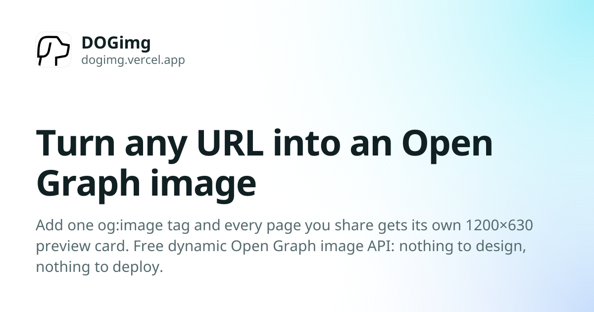
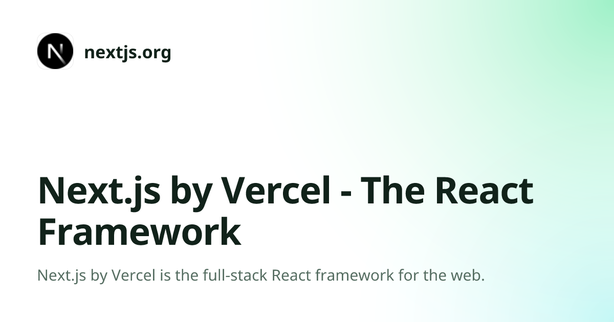
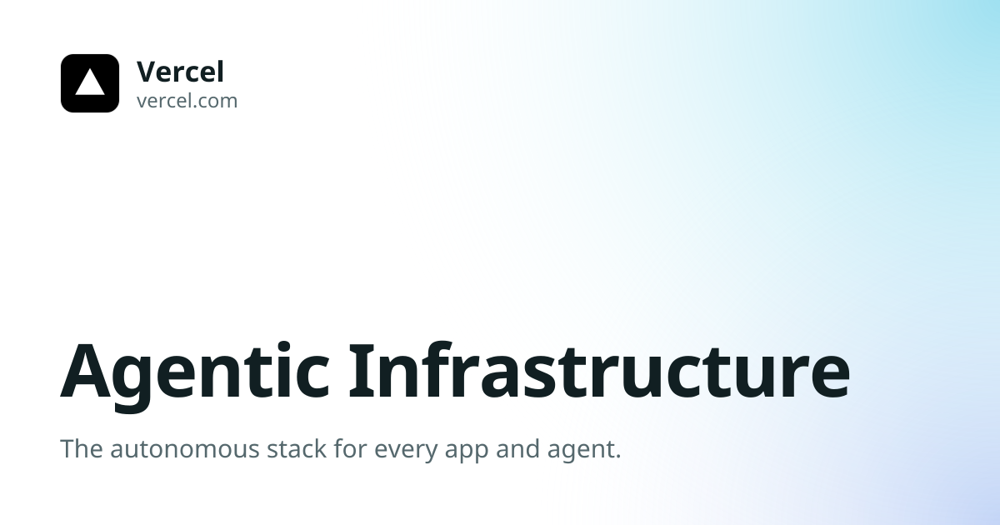

# DOGimg

Turn any URL into an Open Graph image.

DOGimg reads a page's title, description, icon and theme color, and draws a
1200x630 card from them. Point your `og:image` at one URL and every page gets
its own preview. Nothing to design, nothing to deploy.

## Try It

- Demo: https://dogimg.vercel.app
- API: `https://dogimg.vercel.app/api/og?url={YOUR_URL}`

## Example Outputs

The images below were generated by real `/api/og` calls from this project.

| URL | Output |
| :-- | :----- |
| `https://dogimg.vercel.app` |  |
| `https://github.com` |  |
| `https://nextjs.org` |  |
| `https://vercel.com` |  |

## Usage

### HTML Meta Tag

```html
<meta property="og:image" content="https://dogimg.vercel.app/api/og?url=https://your-site.com/post" />
<meta property="og:image:width" content="1200" />
<meta property="og:image:height" content="630" />
<meta name="twitter:card" content="summary_large_image" />
```

### Next.js Metadata (App Router)

```ts
export async function generateMetadata() {
  const pageUrl = "https://your-site.com/post";

  return {
    openGraph: {
      images: [
        `https://dogimg.vercel.app/api/og?url=${encodeURIComponent(pageUrl)}`,
      ],
    },
  };
}
```

## API

### Endpoint

`GET /api/og?url={TARGET_URL}`

### URL Format

`https://dogimg.vercel.app/api/og?url={YOUR_URL}`

### Query Params

- `url` (string): The page to draw a card for. It has to be public and served
  over http or https; without a scheme, https is assumed. Pass it through
  `encodeURIComponent` if it has a query string of its own.
- If `url` is omitted, DOGimg uses a default sample URL.

### Response

- `200`: `image/png` (1200x630). Cached for an hour in browsers and a day on the
  CDN. After that day, the next request still gets the old card while a fresh
  one is drawn behind it. Apps that show link previews keep their own copy on
  top of that.
- `200`, when the page can't be fetched or isn't HTML: still an image, a plain
  card carrying the hostname, cached for five minutes at most.
- `400`: The `url` isn't http(s), has no hostname, or names a private or local
  address.
- `500`: Failed to generate image

### Example

```bash
curl "https://dogimg.vercel.app/api/og?url=https://github.com" --output og.png
```

## Run Locally

```bash
npm install
npm run dev
```

Then open:

- `http://localhost:3000`
- `http://localhost:3000/api/og?url=https://github.com`

### Environment

- `NEXT_PUBLIC_SITE_URL` (optional): origin used in the copied meta tag and in
  the site's own metadata. Defaults to `https://dogimg.vercel.app`. Set it to
  `http://localhost:3000` locally so the snippets you copy point at your own
  instance.

### Checks

```bash
npm test
npm run lint
npm run build
```

## How It Works

1. Fetch the page: follow redirects and wait up to five seconds. The HTML is
   read as it is sent; scripts are not run, so the metadata has to be in what
   your server returns.
2. Read its metadata. The title comes from `og:title`, then `<title>`; the
   description from `og:description`, `twitter:description`, then the meta
   description; the site name from `og:site_name`, then the hostname. A site
   name repeated at the start or end of the title is trimmed, so the card says
   it once.
3. Pick the card's accent color: the page's `theme-color` when it is a color
   rather than a gray (written as hex, `rgb()` or a name), otherwise the
   favicon's dominant color, otherwise a hue derived from the hostname (so a
   site always gets the same one). To choose it yourself, declare a non-gray
   `theme-color`.
4. Render a 1200x630 PNG with `next/og` (the `@vercel/og` build that ships
   inside Next.js), set in Noto Sans. Korean, Japanese and Chinese text is
   covered too.

## License

MIT. See [LICENSE](LICENSE).
